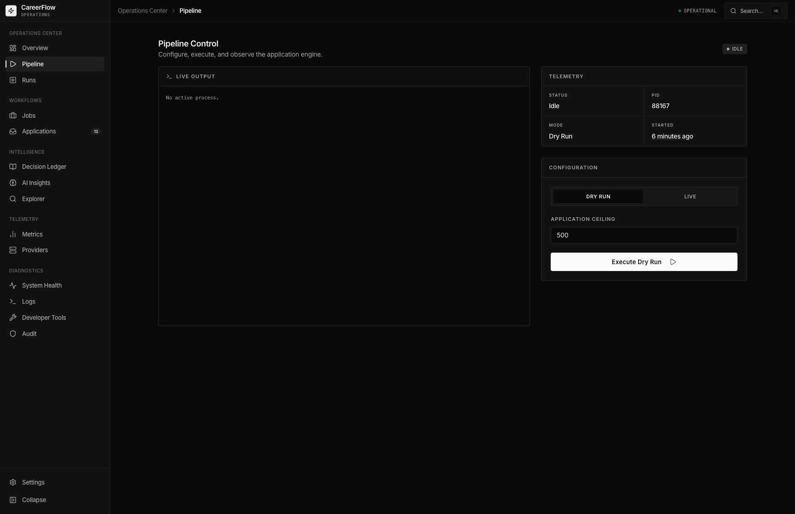
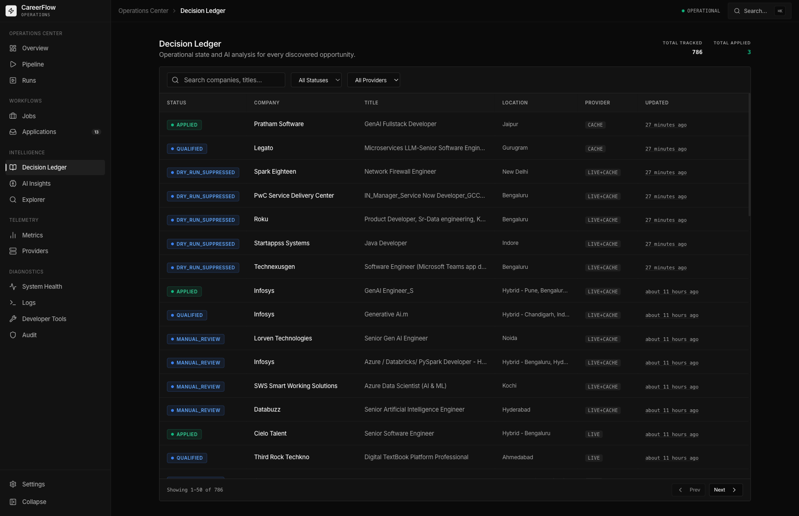
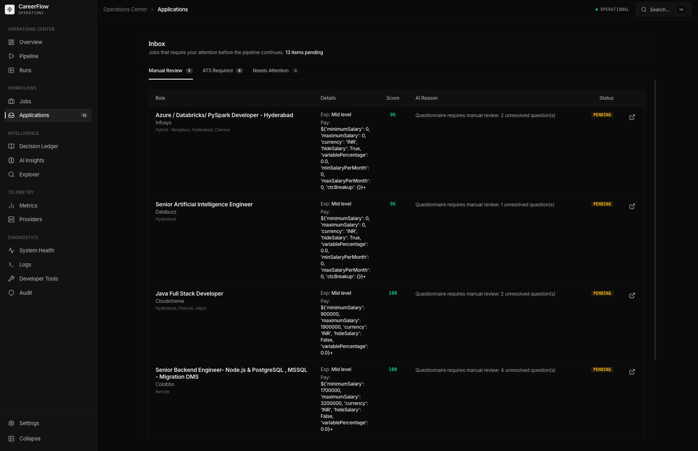
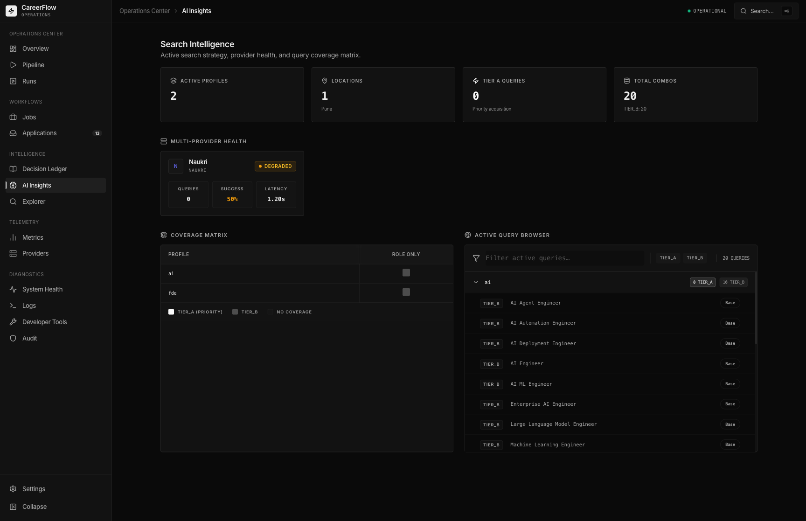
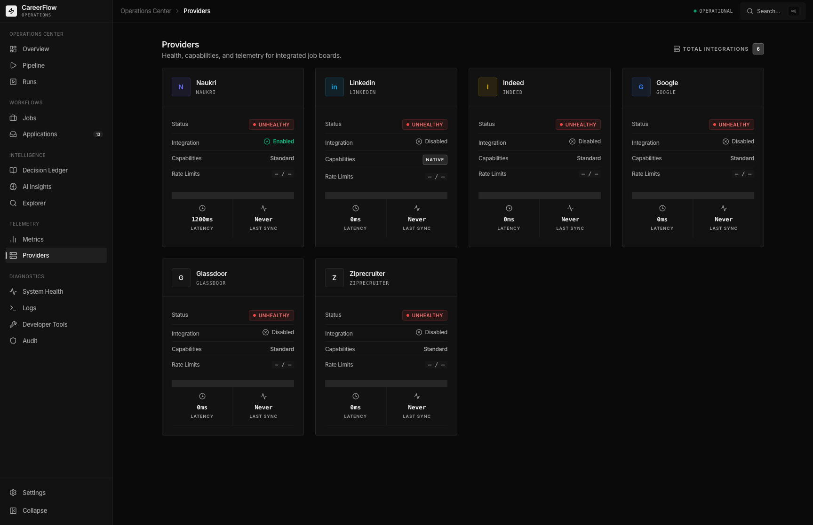
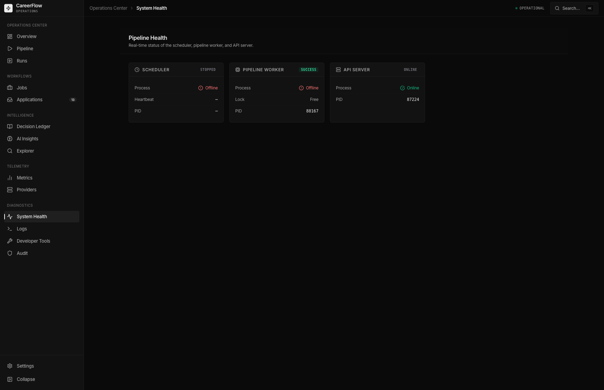
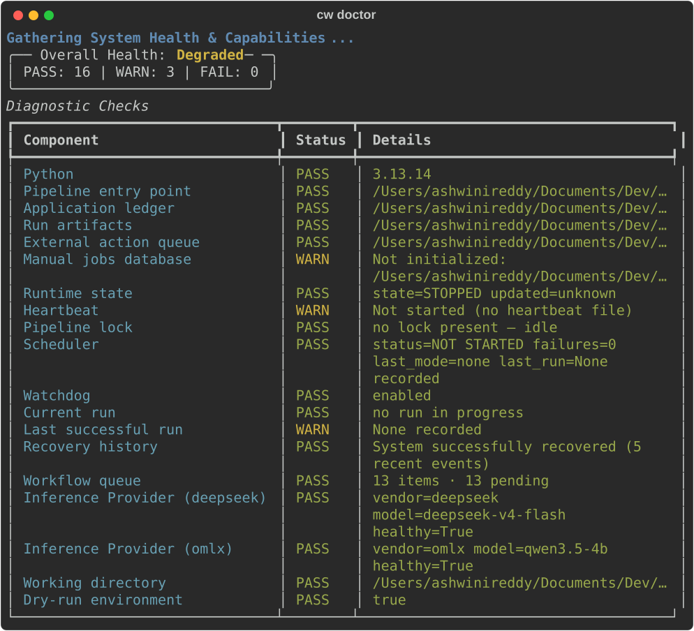
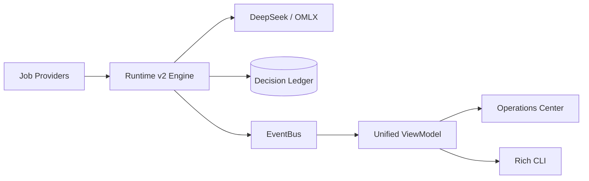

<p align="center">
  
</p>

<h1 align="center">Career Workflow</h1>

<p align="center">
  <strong>AI-powered Job Operations Platform</strong>
</p>

<p align="center">
  
  
  
  
  
  
</p>

<p align="center">
  <em>Real-time Runtime • Operator Console • Multi-provider Inference • Decision Ledger</em>
</p>

---

## What is Career Workflow?

Career Workflow is a strict, policy-driven job operations platform designed to treat the job hunt as an engineering pipeline. Standard "auto-apply" tools blast identical resumes blindly, resulting in rapid rejection. Career Workflow is different.

It performs **candidate-aware classification, intelligence-driven evaluation, and highly controlled application orchestration**, driven by an immutable Decision Ledger and monitored via a React-based Operations Center.

### Why is it different?
- **AI Job Intelligence:** Discards keywords for semantic AI evaluation based on stack overlap, experience, and transition viability.
- **Closed-Loop Feedback:** Adjusts thresholds based on real lifecycle feedback (Submitted → Viewed → Interview).
- **Strict Execution Policy:** Never applies in an uncontrolled loop. Caps execution velocity via configurable company, role family, and run budgets.

---

## Key Features

- **Operations Center**: A 16-surface React dashboard providing live visibility into the pipeline, manual action queues, and system health.
- **Runtime v2**: A decoupled, event-driven engine leveraging a Unified Runtime ViewModel for real-time telemetry.
- **Multi-Provider Inference**: Native support for **DeepSeek** as the primary intelligence engine with instant failover to local **OMLX** (`qwen3.5-4b`) when APIs degrade.
- **Decision Ledger**: SQLite WAL-backed single source of truth for every job acquired, scored, and submitted. Infinite loops and duplicate applications are cryptographically impossible.
- **Rich CLI**: A stunning, information-dense terminal UI that acts as a first-class citizen for pipeline supervision.
- **Learning Platform**: Tracks response velocity, conversion analytics, and LLM token cost breakdowns in real-time.

---

## Screenshots

<div align="center">
  
  
  <br>
  
  
  <br>
  
  
  <br>
  
  
</div>

---

## Architecture Overview

Career Workflow isolates Domain execution from Presentation through an EventBus.



> **For deep technical specifications on the Runtime, Inference, and EventBus, see [Architecture Documentation](#documentation).**

---

## Getting Started

### Prerequisites
- Python 3.13+
- Node.js 20+
- A valid DeepSeek API Key (or a local OMLX endpoint)

### Installation

```bash
git clone https://github.com/your-username/career-workflow.git
cd career-workflow

# 1. Setup Environment
python -m venv .venv
source .venv/bin/activate
pip install -e .

# 2. Configure Settings
cp .env.example .env
# Edit .env with your DEEPSEEK_API_KEY and Naukri credentials.
```

---

## Quick Start

1. **Verify System Health**
   ```bash
   cw doctor
   ```

2. **Start the Control Plane (Backend)**
   ```bash
   uvicorn api.main:app --reload --port 8000
   ```

3. **Start the Operations Center (Frontend)**
   ```bash
   cd frontend && npm install && npm run dev
   ```

4. **Launch a Dry Run via CLI**
   ```bash
   cw run --max-applications 25
   ```

---

## Core Concepts

### CLI (`cw`)
The `cw` Typer CLI wraps all operational tasks. It features a custom Rich renderer that turns the terminal into a live telemetry dashboard during runs.
- `cw run`: Execute a live or dry pipeline run.
- `cw doctor`: Comprehensive system diagnostic pre-flight check.
- `cw inspect latest`: Deep-dive into execution artifacts.

### Operations Center
Located at `http://127.0.0.1:5173/`, the Operations Center allows you to:
- Monitor live Pipeline runs without leaving the browser.
- Triage jobs requiring Manual Review.
- Visualize AI Funnel Conversion.
- Track application status (Submitted → Interview).

### Inference Platform
The Inference Platform (`src/inference/`) supports a cascading chain of AI providers. It natively uses DeepSeek (`deepseek-v4-flash`) for unmatched reasoning at low token cost, and immediately fails over to a local `OMLX` proxy if DeepSeek experiences downtime or rate limits.

### Decision Ledger
The heart of the application is a SQLite database operating in Write-Ahead Log (WAL) mode. Every classification, fit score, and application failure is permanently recorded here. It serves as the immutable memory that prevents duplicate applications and tracks the health of the recruiter funnel.

---

## Project Structure

```text
career-workflow/
├── api/                   # FastAPI backend control plane
├── config/                # YAML search policies and runtime profiles
├── data/                  # SQLite Decision Ledger & cache stores
├── docs/                  # Deep architecture & technical documentation
├── frontend/              # React Operations Center
├── src/
│   ├── cli/               # Typer entrypoints & Rich rendering
│   ├── core/              # Learning Platform & Cost Engine
│   ├── inference/         # LLM Provider routing
│   ├── orchestration/     # Pipeline, EventBus, Decision Ledger
│   └── runtime/           # V2 State Manager & Unified ViewModel
└── tests/                 # 500+ unit and integration tests
```

---

## Documentation

For deep technical dives into the subsystems, explore the `docs/` directory:

- [Architecture Guide](docs/Architecture.md)
- [Runtime v2 Internals](docs/Runtime.md)
- [Inference Platform](docs/Inference.md)
- [Job Providers](docs/Providers.md)
- [Decision Ledger](docs/DecisionLedger.md)
- [Learning Platform](docs/Learning.md)
- [Operations Center Specs](docs/OperationsCenter.md)

---

## Roadmap

- Native ATS routing bypassing external job boards.
- Webhook endpoints for incoming Recruiter communications.
- Interview pipeline intelligence tracking.

---

## Contributing

Pull requests are welcome. Before submitting, please ensure:
1. `cw doctor` passes.
2. `pytest` completes with 100% coverage on core domain logic.
3. Code is formatted via `ruff`.

---

## License

MIT License. See `LICENSE` for more information.
