<p align="center">
  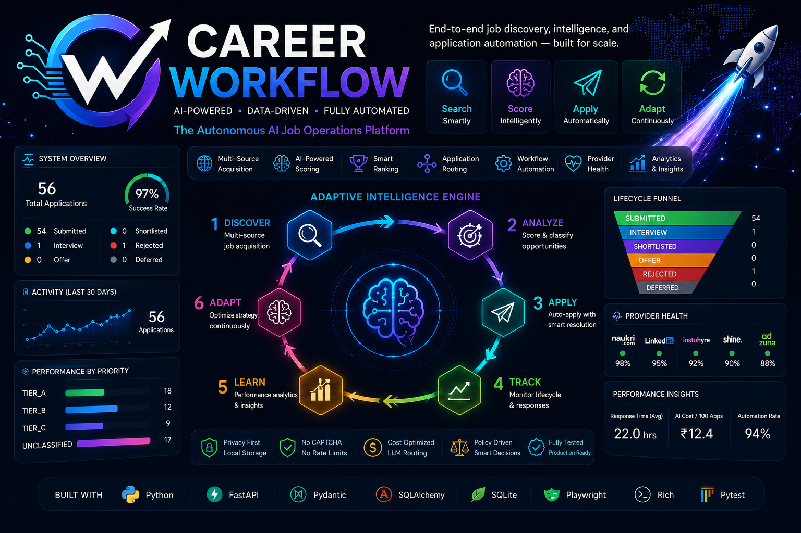
</p>

<h1 align="center">Career Workflow</h1>

<p align="center">
  <strong>AI-Powered Job Discovery, Intelligence & Application Operations Platform</strong>
</p>

<p align="center">
  
  
  
  
  
  
  
  
  
  
  
</p>

<p align="center">
  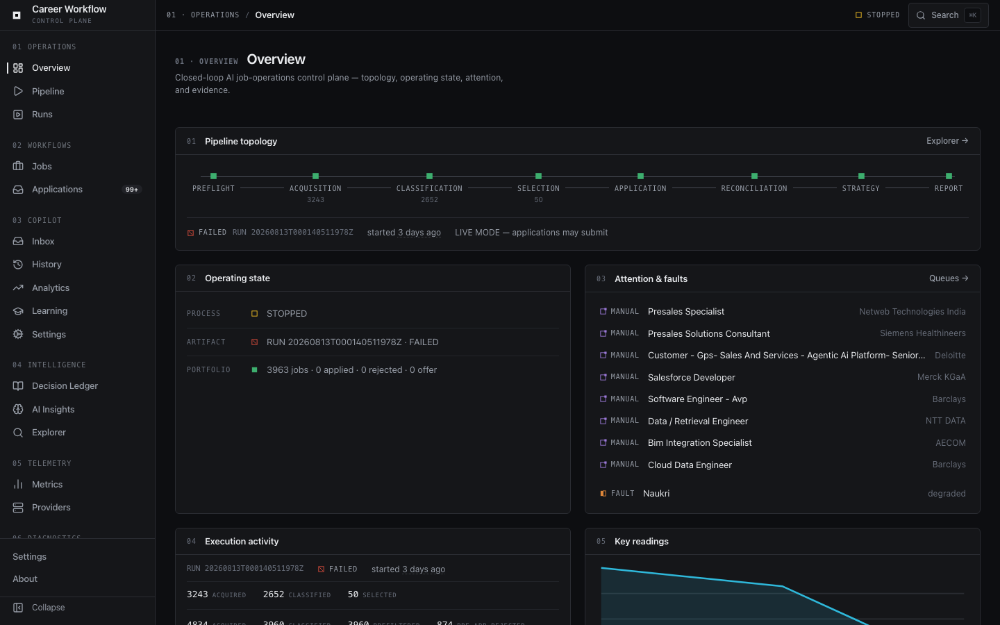
  <br>
  <em>The Career Workflow Operations Console.</em>
</p>

## At a Glance

| Category | Details |
|----------|---------|
| **What It Is** | AI-powered job discovery, evaluation, application orchestration, and lifecycle intelligence platform |
| **Architecture** | Policy-driven, event-driven, closed-loop decision pipeline |
| **Providers** | Naukri API + JobSpy (Indeed, LinkedIn, Google Jobs) |
| **Runtime** | Runtime v2 with interactive and daemon execution modes |
| **Frontend** | React 19 Operations Console (16 operational surfaces) |
| **Backend** | FastAPI + Python orchestration engine |
| **Persistence** | SQLite WAL Decision Ledger with lifecycle tracking |
| **AI Capabilities** | Candidate-aware qualification, LLM fit scoring, hybrid questionnaire resolution, adaptive strategy |
| **LLM Support** | Gemini, Ollama / OMLX, OpenAI-compatible providers (OpenAI, DeepSeek, OpenRouter) |
| **Cost Optimization** | Multi-stage filtering, InferenceRouter, token budget management, score caching |
| **Application Engine** | Native API execution, ATS routing, external application handling, manual review queue |
| **Observability** | Pipeline Explorer, Run Inspector, Analytics, Audit Framework, Runtime Diagnostics |
| **Automation** | Scheduler, crash recovery, lock management, telemetry, health monitoring |
| **Testing** | **524 automated unit & integration tests passing** |
| **License** | Personal automation and research |

---

## 📖 Table of Contents

- [1. Project Overview](#1-project-overview)
- [2. Why Career Workflow Exists](#2-why-career-workflow-exists)
- [3. Key Features](#3-key-features)
- [4. Screenshots](#4-screenshots)
- [5. Architecture Overview](#5-architecture-overview)
- [6. Core Concepts](#6-core-concepts)
- [7. Runtime](#7-runtime)
- [8. Operations Console](#8-operations-console)
- [9. Inference Platform](#9-inference-platform)
- [10. Decision Ledger](#10-decision-ledger)
- [11. CLI Usage](#11-cli-usage)
- [12. Installation](#12-installation)
- [13. Quick Start](#13-quick-start)
- [14. Configuration](#14-configuration)
- [15. Project Structure](#15-project-structure)
- [16. Documentation Links](#16-documentation-links)
- [17. Development](#17-development)
- [18. Testing](#18-testing)
- [19. Roadmap](#19-roadmap)
- [20. Contributing](#20-contributing)
- [21. License](#21-license)

---

## 1. Project Overview

**Career Workflow** is a policy-driven, closed-loop job application orchestration system. It automates job acquisition, candidate-aware evaluation, ranking, policy-controlled application execution, and lifecycle tracking.

It uses AI to determine fit instead of just keywords, handles multi-page application questionnaires dynamically, and adapts its application strategy based on actual outcomes.

### Technology Stack

**Backend**
- **Core Language:** Python 3.10+ (Orchestration and execution logic)
- **API Layer:** FastAPI (Serves data & routes to the Operations Console)
- **Server:** Uvicorn (ASGI web server)
- **Scraping / Automation:** Playwright / JobSpy (Provider integration and headless browsing)
- **State Management:** SQLite WAL Mode (Authoritative Decision Ledger for jobs, analytics, and lifecycle)

**Frontend**
- **Core Framework:** React 19 (TypeScript)
- **Build Tool:** Vite (Fast module bundling and HMR)
- **Styling:** Tailwind CSS (Utility-first CSS)
- **UI Components:** Radix UI / shadcn (Accessible component primitives)
- **State / Fetching:** Zustand / React Query (Global state and API data synchronization)
- **Data Visualization:** Recharts (Analytics and funnel charts)
- **Routing:** React Router DOM (Client-side navigation)


## From API Client to AI Job Operations Platform

Career Workflow represents the evolution of a lightweight API client into a production-oriented AI job operations platform while preserving the complete engineering history of that evolution.

The project originated from the open-source NopeRi project by Traverser25, which provided a foundation for authentication, job search, and direct application through the Naukri API.

From that foundation, the repository evolved through multiple architectural generations into the system presented today.

### Engineering Evolution

### Original Foundation

- Authentication
- Profile Management
- Job Search
- Direct Apply

### Generation 2 — Intelligent Pipeline

- Multi-query acquisition
- Candidate-aware scoring
- Policy engine
- Search resilience

### Generation 3 — Operational Intelligence

- Decision Ledger
- Lifecycle monitoring
- Analytics
- Adaptive strategy

### Generation 4 — Production Platform

- Runtime v2
- Operations Console
- Pipeline Explorer
- Audit Framework
- Multi-provider architecture
- Cost-optimized LLM routing

The original upstream project served as the initial API foundation. The orchestration architecture, runtime systems, AI pipeline, operational tooling, frontend, and intelligence platform contained in this repository were designed and implemented as part of the evolution of Career Workflow.

Repository history has been intentionally preserved to document that engineering evolution.

---

## 2. Why Career Workflow Exists

**The Problem:** Standard "auto-apply" bots blindly blast identical resumes to hundreds of companies based on simple keyword matches, leading to poor candidate fit, immediate rejections, and low interview rates. They ignore the nuances of role transition, work-mode constraints, and the reality that different applications require distinct strategies.

**The Solution:** Career Workflow is built as a decision pipeline, not a simple loop over search results. It prioritizes *controlled, high-quality* applications over volume, leveraging AI for both parsing Job Descriptions and resolving complex application questions. It features a React-based Operations Console to give you total visibility and control over the pipeline.

**Designed For:** Software Engineers, AI Engineers, Data Scientists, and tech professionals looking to optimize their job search process with precision rather than spam.

### Career Workflow vs. Typical Auto-Apply Bot

Most "auto-apply" tools optimize for **application volume**. Career Workflow treats job searching as a **closed-loop decision system** that combines AI-assisted evaluation, policy-controlled execution, persistent operational state, and continuous learning from recruiter outcomes.

| Feature | Typical Auto-Apply Bot | Career Workflow |
|---------|-------------------------|-----------------|
| **Matching** | Keyword matching | Candidate-aware AI evaluation |
| **Optimization** | Maximizes application count | Optimizes application quality |
| **Execution** | Stateless execution | Persistent application ledger |
| **Strategy** | Fixed rules | Evidence-gated adaptive strategy |
| **Workflow** | Simple apply loop | Multi-stage decision pipeline |
| **Visibility** | Minimal visibility | Full Operations Console |
| **Observability** | Basic logging | End-to-end observability |
| **Feedback Loop** | None | Closed-loop continuous improvement |

#### Decision Pipeline Comparison

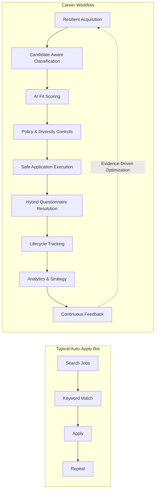

Instead of maximizing the number of applications submitted, Career Workflow focuses on maximizing the **quality, safety, and effectiveness** of every application. Each execution contributes new operational evidence through lifecycle tracking, analytics, and recruiter outcomes.

---

## 3. Key Features

- **AI Job Discovery & Providers:** Broad, resilient search matrix capturing roles from Naukri and JobSpy (Indeed, LinkedIn, Google) with provider health safeguards.
- **Multi-stage Classification:** Cascading filters that drop bad fits early (deterministic rejections) before utilizing LLMs for deep scoring (`LLM Reviewed`).
- **AI Ranking & Post-Score Guard:** Candidate-grounded fit scoring assessing stack overlap, transition-role viability, seniority constraints, score normalization, and Posting Age Policy filtering.
- **Decision Ledger:** SQLite WAL-backed authoritative decision ledger tracking candidate qualification, job lifecycle, terminal state accounting, and full audit trails.
- **Application Routing:** Intelligent dispatch of jobs to the correct engine (Naukri Native, ATS handler, or External Fallback).
- **Provider Architecture:** Unified interface supporting multiple job board providers seamlessly.
- **LLM Provider Architecture:** Configurable `OpenAICompatibleProvider` supporting seamless failover across OpenAI, DeepSeek, OpenRouter, and local `OMLXProvider` fallback.
- **Manual Review Queue:** Intercepts ambiguous roles or complex applications for human review.
- **ATS Detection:** Prevents dead-ends by detecting and routing specific Applicant Tracking Systems.
- **Live Pipeline & Intelligence:** Real-time execution with lock management, crash recovery, dry-run safety modes, and thread-safe telemetry projections.
- **Event-driven Architecture & Observability:** Decoupled execution model utilizing a robust internal Event Bus and immutable JSON run artifacts.
- **Career Workflow Operations Console:** A unified 16-surface React command center to control pipelines, inspect the Decision Ledger, explore runs, and audit system components.
- **Pipeline Intelligence:** Granular funnel conversion tracking, response velocity, LLM cost analysis, and subtrack performance reporting.
- **Pipeline Explorer:** Interactive deep dive into decision trees, stage timelines, execution manifests, and state histories of specific runs.
- **Audit System:** Automated multi-phase diagnostic framework generating markdown reports for components, AI integration, and application policies.
- **SQLite Cache & Deduplication:** Persistent job ledger, vacancy fingerprinting, and search caching to avoid redundant operations and network bans.
- **Resume Profiles & Candidate Architecture:** Single candidate profile injection for automated resume routing and hybrid questionnaire resolution.
- **InferenceRouter & Cost Control:** Dynamic LLM token budget management and provider inference routing.

---

## 4. Screenshots

<details>
  <summary><strong>📷 Click to expand the Career Workflow Operations Console Screenshot Gallery</strong></summary>
  <br>
  <p align="center">
    
    <br>
    <em><strong>Overview Dashboard</strong>: High-level operational metrics, active pipeline execution, and portfolio conversion.</em>
  </p>
  <hr>
  <p align="center">
    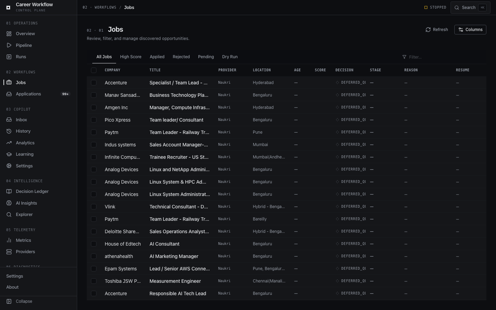
    
  </p>
  <p align="center">
    <em>Left: <strong>Jobs Workspace</strong> showing classified inventory and score tiers. Right: <strong>Inbox / Manual Review</strong> for tracking lifecycle & manual actions.</em>
  </p>
  <hr>
  <p align="center">
    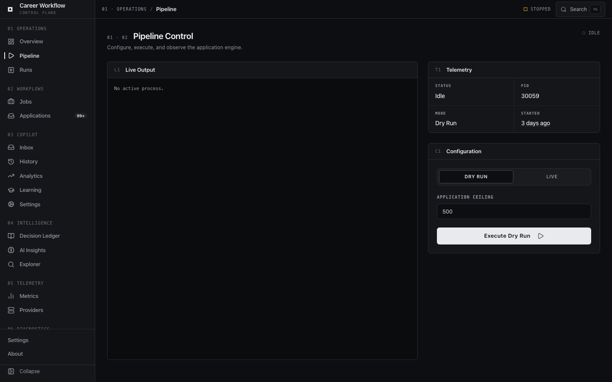
    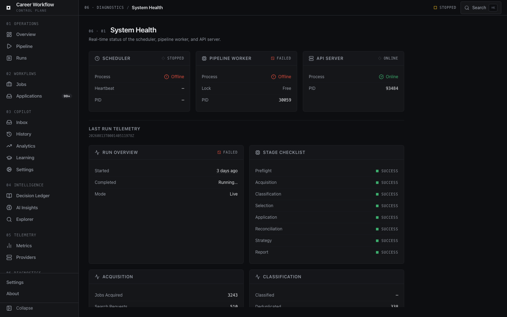
  </p>
  <p align="center">
    <em>Left: <strong>Pipeline Control</strong> for launching live or dry-run executions. Right: <strong>System Health</strong> and preflight diagnostics.</em>
  </p>
  <hr>
  <p align="center">
    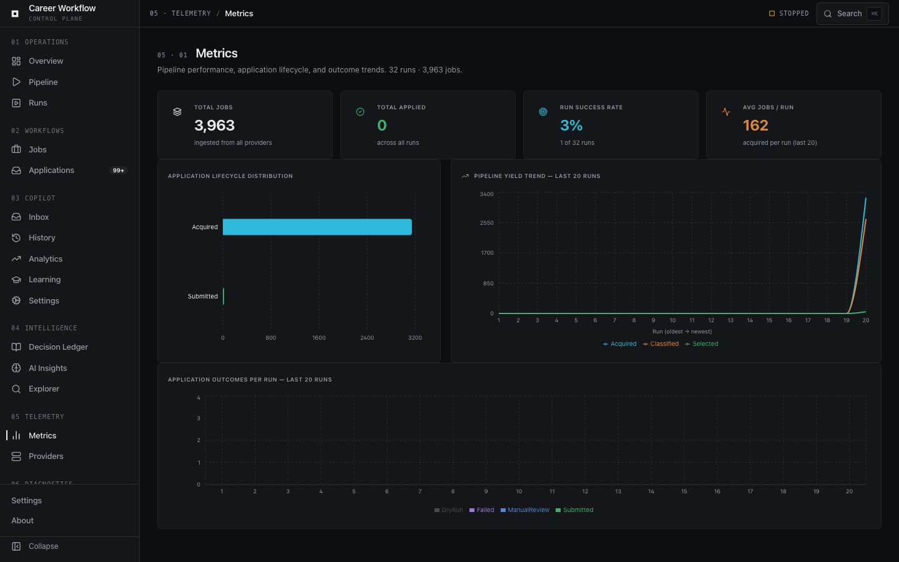
    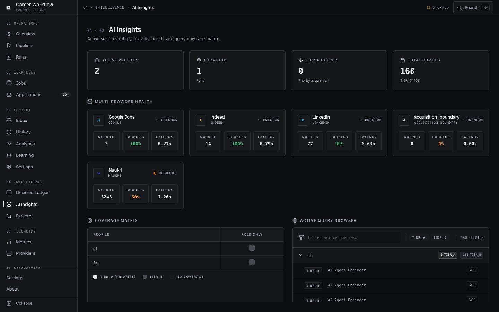
  </p>
  <p align="center">
    <em>Left: <strong>Pipeline Intelligence & Analytics</strong> covering funnel conversion. Right: <strong>Providers & Search Intelligence</strong> showing source acquisition breakdowns.</em>
  </p>
  <hr>
  <p align="center">
    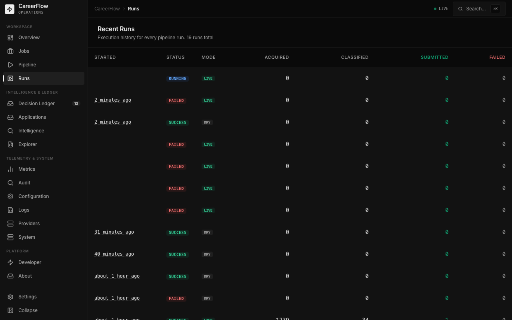
    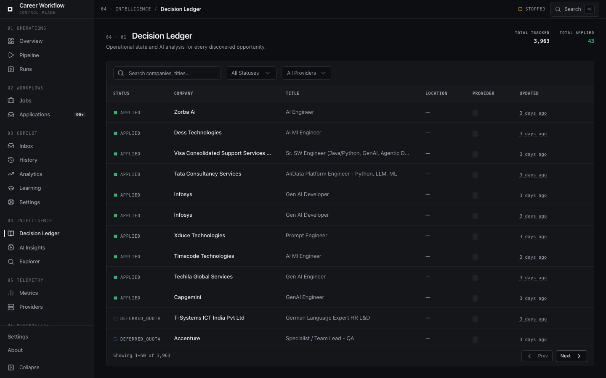
  </p>
  <p align="center">
    <em>Left: <strong>Pipeline Explorer & Run Inspector</strong> for deep artifact inspection. Right: Native <strong>Dark Mode</strong> theme across all pages.</em>
  </p>
</details>

---

## 5. Architecture Overview

Career Workflow is a closed-loop AI job operations platform that combines resilient job discovery across multiple **Providers**, candidate-aware qualification (`LLM Reviewed`), policy-controlled selection, application execution, questionnaire resolution, lifecycle tracking, funnel analytics, and evidence-gated strategy adaptation.

The **Career Workflow Operations Console** (a modern 16-surface React application) sits above these core systems, providing a single operational control plane for pipeline execution, **Decision Ledger** inspection, **Pipeline Explorer** run debugging, system auditing, and runtime diagnostics without compromising underlying ledger integrity or policy boundaries.

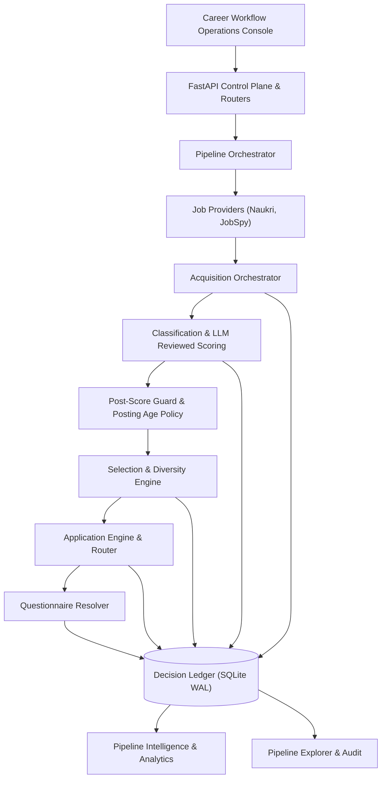

### System at a Glance

| Layer | What it does | State |
|---|---|:---:|
| **Authentication** | Session login, bearer token, cookies, OTP/MFA | ✅ |
| **Providers** | Multi-provider acquisition matrix (Naukri API, JobSpy: Indeed / LinkedIn / Google) | ✅ |
| **Search termination** | Empty-page, partial-page, repeated-page and challenge stop conditions | ✅ |
| **Resilience** | Search cache, challenge detection, cooldown, partial-result preservation and fallback | ✅ |
| **Classification** | AI relevance, title quality, red flags, candidate fit and transition-role compatibility | ✅ |
| **Work-mode policy** | Remote-anywhere; office/hybrid/unknown only when Pune-compatible | ✅ |
| **Job Age Policy** | Deterministically rejects jobs older than configurable max age threshold (default 30 days) | ✅ |
| **Ranking & Scoring** | Candidate-grounded `LLM Reviewed` fit scoring, Post-Score Guard normalization, and score caching | ✅ |
| **Selection Policy** | Thresholds, duplicate prevention, run limits, and dry-run controls for **Selected** batching | ✅ |
| **Diversity Controls**| Company, role-family and vacancy-fingerprint concentration control | ✅ |
| **InferenceRouter** | Cost control, token budget management, and model routing | ✅ |
| **Execution** | Direct application, ATS router, and questionnaire application flows | ✅ |
| **Resolution** | Deterministic evidence + constraints + LLM fallback | ✅ |
| **Failure handling** | Response interpretation, retry policy, terminal state accounting | ✅ |
| **Decision Ledger** | Authoritative SQLite WAL state, transaction audit trail, run summaries | ✅ |
| **Monitoring** | Server application-history reconciliation | ✅ |
| **Lifecycle** | Submitted → Viewed → Shortlisted → Interview → Outcome | ✅ |
| **Pipeline Intel** | Velocity, age, response time, funnel metrics, and subtrack performance | ✅ |
| **Pipeline Explorer** | Stage timelines, decision tree history, execution manifests, and artifact inspection | ✅ |
| **Control plane** | Career Workflow Operations Console (16 pages) for execution, inspection, and triage | ✅ |
| **System Health** | Preflight diagnostics, runtime watchdog, database locks, and automated system audit reports | ✅ |
| **Automation** | Daemon scheduler with runtime recovery, locking, heartbeat and interactive workstation mode | ✅ |
| **Runtime** | Process state, lock management, recovery, watchdog and heartbeat | ✅ |
| **Observability** | Stage metrics, rejection analytics, runtime artifacts and execution reports | ✅ |

### Architectural Flow

```mermaid
flowchart TD
    subgraph Discovery ["Acquisition (Providers)"]
    S1[Naukri Provider] --> B[Acquisition Orchestrator]
    S2[JobSpy Provider: Indeed / LinkedIn / Google] --> B
    B --> C{Search Healthy?}
    C -->|Yes| SR[Summary Ranking & Qualification]
    C -->|Challenge| E[Challenge Cooldown]
    E --> F[Search Cache Fallback]
    F --> SR
    end

    subgraph Ranking ["Classification & LLM Reviewed Scoring"]
    SR -->|Qualified| DF[Detail Fetch]
    DF --> D[LLM Scoring & LLM Reviewed]
    D --> PSG[Post-Score Guard & Posting Age Policy]
    PSG --> G[Ranked Candidates Pool]
    end

    subgraph Selection ["Selection & Diversity"]
    G --> H[Selection Strategy]
    H --> I[Application Budget & Diversity Controls]
    I --> J[Selected Applications Batch]
    end

    subgraph Router ["Application Router"]
    J --> L[Application Router]
    end

    subgraph Observability ["Observability & Intelligence"]
    L -.-> O[Decision Ledger (SQLite WAL)]
    O -.-> P[Pipeline Intelligence]
    O -.-> PE[Pipeline Explorer]
    O -.-> AU[Audit System Engine]
    end

    subgraph Engines ["Application Execution Engines"]
    L --> M{Application Type}
    M -->|Naukri Native| NAE[Naukri Engine]
    M -->|ATS Redirect| ATS[ATS Handler]
    M -->|External| EXT[External Engine]

    NAE --> Q[Questionnaire Resolver]
    Q --> N[(Decision Ledger SQLite WAL)]
    end

    subgraph ControlPlane ["Control Plane"]
    UI[Career Workflow Operations Console] --> API[FastAPI Control Plane & Routers]
    API --> N
    API --> B
    API --> L
    end
```

---

## 6. Core Concepts

### 6.1 Resilient Job Acquisition

Search acquisition is built to degrade safely. The acquisition layer is a bounded search matrix rather than a single search call.

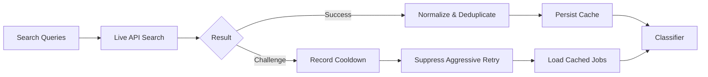

Current acquisition capabilities include:
- A broad portfolio of AI, GenAI, LLM, RAG, agentic AI, ML, MLOps, NLP, computer-vision and AI-enabled full-stack search families.
- Configurable experience buckets instead of a single hard-coded experience search.
- Configurable pagination depth and per-page result sizing.
- Deduplication across overlapping queries, experience buckets and pages.
- Early termination on empty or partial terminal pages.
- Repeated-page fingerprint detection to prevent useless pagination loops.
- Persistent search-result caching with TTL.
- Source attribution for live-only, cache-only and live-plus-cache jobs.
- Challenge detection with partial results preserved.
- Persistent challenge cooldown state with explicit bypass via `--force-live`.

### 6.2 Candidate-Aware Job Intelligence

The classifier (`src/client/job_classifier.py`) is not a generic keyword filter. It evaluates jobs against the target candidate profile and transition strategy.

The classification pipeline is deliberately staged so cheap deterministic rejection happens before expensive full-JD scoring:
```text
deduplicate → hard vetoes → title-quality filter → company vetoes → AI relevance gate → detail-fetch budget allocation → full JD red-flag analysis → structured work-mode + location policy → LLM-assisted fit scoring → post-score deterministic guards → ranked candidates
```

- **Location policy:** Asymmetric by design (e.g., Remote is eligible globally; Office/Hybrid is conservatively eligible only when locally compatible).
- **Posting Age Policy:** Jobs older than a configurable threshold (default 30 days) are deterministically rejected before application to avoid wasting resources on stale listings. See `job_policy` in `config/search_strategy.yaml`.

### 6.3 Policy and Diversity Engine

The system does not let a ranking score directly trigger unlimited applications.

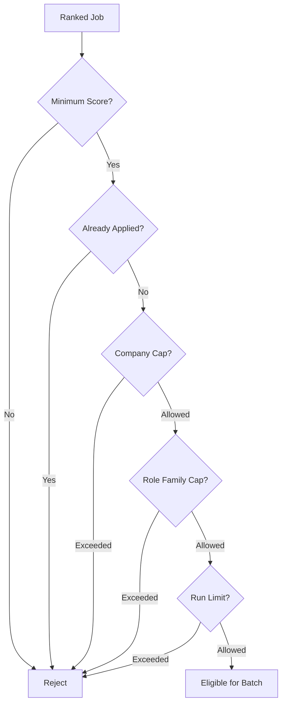

Controls include minimum score gates, duplicate application prevention, max applications per run, maximum applications per company per run, role-family concentration limits, and vacancy-fingerprint deduplication.

### 6.4 Hybrid Questionnaire Intelligence

Questionnaires are handled as a constrained resolution problem.

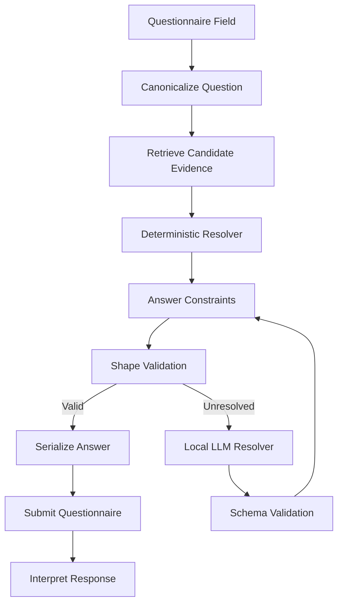

Resolution combines candidate profile data, deterministic matching, allowed-answer constraints, answer-shape validation, and local OpenAI-compatible LLM fallback, falling back to capturing unresolved cases for manual review.

### 6.5 Application Execution and Failure Handling

The executor interprets application responses semantically rather than treating every HTTP response as a binary success or failure. Recognized outcomes include `Applied`, `AlreadyApplied`, `QuestionnaireRequired`, `RecoverableFailure`, `TerminalFailure`, and `ManualReview`.

### 6.6 Safety and Control Model

Automation is constrained at multiple levels:

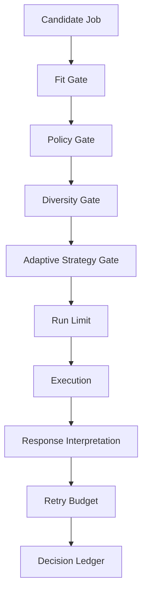

### 6.7 Closed-Loop Strategy

The defining feature of the system is the feedback loop. Adaptive behavior is deliberately evidence-gated. A rejection or two does not cause the system to thrash. Strategy changes only after sufficient outcome evidence exists.

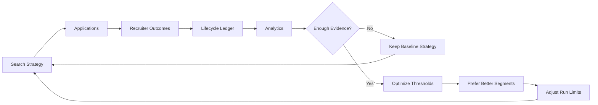

Current adaptive controls include: minimum score threshold; maximum applications per run; preferred priority tiers; preferred role subtracks; allocation toward stronger-performing segments.

### 6.8 Design Principles

- **Candidate-grounded automation:** Application decisions based on explicit candidate profile data.
- **Controlled throughput:** More applications are not automatically better. Policy, diversity, and strategy layers control volume.
- **Conservative failure semantics:** Unknown responses are not assumed to be successes. They are classified and captured.
- **Idempotent reconciliation:** Running the monitor repeatedly should not create false changes.
- **Evidence before adaptation:** The strategy engine does not overreact to tiny samples.
- **Modular boundaries:** Acquisition, classification, policy, execution, and analytics remain independently testable.
- **Local-first intelligence:** Questionnaire LLM fallback can run against a local OpenAI-compatible endpoint.

---

## 7. Runtime

Career Workflow supports two execution models via `run_scheduler.py`.

### Daemon Mode (Production)
Runs continuously using the configured schedule.
```bash
python run_scheduler.py
```
- waits until the configured full-run window
- executes incremental searches using the configured interval

### Interactive Mode (Workstation)
Optimized for running on a local development machine.
```bash
python run_scheduler.py --interactive
```
- immediately performs a full pipeline run
- stays alive after completion, performs incremental searches every 30 minutes

### Interactive Session
Automatically terminates after a work session.
```bash
python run_scheduler.py --interactive --session-hours 2
```

### Factory Reset
Use this command to remove all generated runtime state and begin with a fresh local portfolio.
```bash
python tools/factory_reset.py        # Interactive (recommended)
python tools/factory_reset.py --yes  # Skip confirmation
```
This preserves source code, configuration, candidate profiles, search strategies, docs, env files, and assets, while clearing artifacts, caches, scheduler state, telemetry, and local app history.

---

## 8. Operations Console

Career Workflow includes a modern React-based operations console for running, monitoring, and inspecting the application system without collapsing operational state into a collection of raw terminal commands.

### Operational Surfaces (16 Dedicated Pages)

| Surface | Route | Purpose |
|---|---|---|
| **Overview Dashboard** | `/dashboard` | High-level operational overview of process state, artifact metadata, throughput, execution progression, and recent runs. |
| **Pipeline Control** | `/pipeline` | Configure, launch, and inspect live or dry-run pipeline executions in real time. |
| **Jobs Workspace** | `/jobs` | Search, filter, and inspect acquired and classified job inventory across qualification tiers. |
| **Decision Ledger** | `/ledger` | Transaction-safe view of all job decisions, score breakdowns, status transitions, and audit records. |
| **Applications** | `/applications` | Complete application portfolio management and lifecycle tracking (Submitted → Interview). |
| **Inbox / Manual Review** | `/inbox` | Triage manually sourced opportunities and inspect unresolved automated shortlists. |
| **Pipeline Intelligence** | `/intelligence` | Funnel conversion charts, response velocity, subtrack breakdown, and LLM token cost analysis. |
| **Pipeline Explorer** | `/explorer` | Deep-dive into specific run decision trees, stage timelines, execution manifests, and detailed job state. |
| **Audit System** | `/audit` | Automated diagnostic framework generating system component, AI integration, and policy reports. |
| **Run Inspector** | `/runs` | Examine immutable run artifacts, execution manifests, git commit state, and raw logs. |
| **System Health** | `/system` | Preflight diagnostics across runtime, storage, database locks, API endpoints, and dependencies. |
| **Configuration** | `/configuration` | Inspect operational configuration, search strategies, posting age threshold, and policy settings. |
| **Providers** | `/providers` | Provider status, health indicators, rate limits, and acquisition breakdowns (Naukri, JobSpy). |
| **Logs Viewer** | `/logs` | Real-time streaming and searching of pipeline execution and backend API server logs. |
| **Metrics** | `/metrics` | Quantitative throughput and conversion visualizations. |
| **Developer Tools** | `/developer` | API schema documentation, endpoint inspection, and integration diagnostic utilities. |

### State Semantics

The control plane distinguishes three different kinds of truth:
1. **PROCESS STATE**: what the launcher-owned process is doing now
2. **ARTIFACT STATE**: what the latest immutable run artifact records
3. **PORTFOLIO STATE**: what the persistent decision ledger records over time

---

## 9. Inference Platform

### Progressive Cost Control & InferenceRouter

The pipeline orders work so expensive operations are concentrated on plausible candidates.

```text
CHEAP / BROAD
    search acquisition
    normalization
    deduplication
    title and hard vetoes
    AI relevance gate
        ↓
MODERATE / NARROWER
    detail-fetch budgeting
    full JD retrieval
    red-flag analysis
    work-mode and location policy
        ↓
EXPENSIVE / SMALL SET
    fit scoring
    application execution
    questionnaire resolution
    local LLM fallback
```

### Provider Selection

The pipeline supports multi-provider execution, allowing you to run Naukri and JobSpy independently or together.

```bash
# Run both providers (default if enabled in config)
cw run --acquisition-mode full --provider all

cw run --provider naukri
cw run --provider jobspy
```

**Provider Health & Degradation Safeguards:** To prevent unstable job boards from exhausting network resources, the system tracks provider health at runtime. If a site returns 0 results or exceptions for 3 consecutive queries, it is marked as `degraded` and remaining queries for that site are skipped.

---

## 10. Decision Ledger

The SQLite WAL decision ledger (`data/application_ledger.db`) is the authoritative state layer and single source of truth for all job decisions, candidate qualification scores, lifecycle stage transitions, acquisition sources, server statuses, terminal state accounting, and complete audit histories.

### Data Model

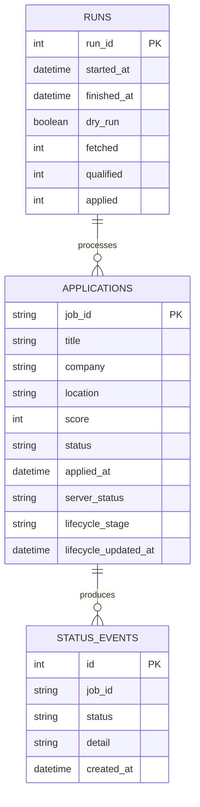

### Runtime Artifacts

Typical local runtime state:

| Artifact | Purpose |
|---|---|
| `application_ledger.db` | Authoritative **Decision Ledger** (SQLite WAL mode) for job decisions, candidate qualification, and lifecycle state |
| `job_search_cache.json` | Search resilience fallback and provider cache |
| `score_cache.json` | LLM score caching and fingerprint store |
| `questionnaire_telemetry.csv` | Hybrid questionnaire resolution diagnostics |
| `responses/` | Raw and unresolved API response captures |

### Pipeline Artifacts (`artifacts/runs/<run_id>/`)

| Artifact | Purpose |
|---|---|
| `manifest.json` | Run metadata, identifiers, timestamps, execution mode, and overall status |
| `timeline.json` | Stage execution timeline, stage metrics, durations, and performance benchmarks |
| `environment.json` | Effective runtime configuration, policies, providers, and execution context |
| `diagnostics.json` | Preflight checks, runtime diagnostics, validation results, and system health |
| `pipeline.log` | Complete terminal output stream captured alongside run artifacts for forensic debugging |
| `classification.json` | Classification stage metrics, AI evaluation summary, and rejection breakdown |
| `selection.json` | Selection stage metrics, policy decisions, and application eligibility summary |
| `application.json` | Application execution metrics, routing decisions, submission results, and failures |
| `selected_jobs.json` | Jobs selected for application, including complete decision history and scoring evidence |
| `rejected_jobs.json` | Jobs rejected during the pipeline, including rejection stage, reason codes, and supporting evidence |
| `applied_jobs.json` | Successfully submitted applications with provider-specific execution details |
| `already_applied.json` | Jobs skipped because an existing application was detected |
| `external_apply.json` | Jobs requiring external or manual application outside native automation |
| `manual_review.json` | Jobs requiring human intervention because automated resolution was not possible |

---

## 11. CLI Usage

`cw run` is the unified staged orchestration entry point.

```bash
cw run

--live
    Enables real application submission.

--confirm-live APPLY_LIVE
    Required confirmation token for live execution.

--provider
    all | naukri | jobspy

--acquisition-mode
    full | incremental

--force-live
    Ignores recorded acquisition cooldowns and performs a live search.

--max-applications
    Optional execution ceiling. Omit for unlimited policy-controlled execution.

--canary
    Automatically limits a live execution to one application.
```

### Example Commands

**Full Live Run / Production Execution**
```bash
cw run --live --confirm-live APPLY_LIVE --acquisition-mode full --provider all --force-live
```

**Broad validation dry run**
```bash
cw run --max-applications 50
```

**Small live canary**
```bash
cw run --live --confirm-live APPLY_LIVE --max-applications 3
```

**Controlled live run**
```bash
cw run --live --confirm-live APPLY_LIVE --max-applications 15
```

---

## 12. Installation

### 1. Clone and create an environment

```bash
git clone https://github.com/your-username/career-workflow.git
cd career-workflow

python -m venv .venv
source .venv/bin/activate

pip install -e .
```

### 2. Configure environment variables

```bash
cp .env.example .env
```

Example:
```env
NAUKRI_USERNAME=your_email@example.com
NAUKRI_PASSWORD=your_password

OMLX_BASE_URL=http://localhost:8000/v1
OMLX_MODEL=your-model-name
OMLX_API_KEY=

MAX_APPLICATIONS_PER_COMPANY_PER_RUN=2
MAX_ROLE_FAMILY_PER_COMPANY=1
```

---

## 13. Quick Start

Start the backend API server:
```bash
uvicorn api.main:app --reload
```

New coopilot server
```bash
PLAYWRIGHT_BROWSERS_PATH="$PWD/.playwright" \
python -m uvicorn api.main:app --port 8090
```
or
```bash
PLAYWRIGHT_BROWSERS_PATH="$PWD/.playwright" \
python -m uvicorn api.main:app --port 8091
```

In a new terminal window, start the React frontend:
```bash
cd frontend
npm install
npm run dev
```

---

## 14. Configuration

Configuration is managed via Python/YAML files in the `config/` directory and environment variables in `.env`.

Representative controls:
```env
APPLICATION_DRY_RUN=true
MAX_APPLICATIONS_PER_RUN=10

JOB_SEARCH_CACHE_PATH=data/job_search_cache.json
JOB_SEARCH_CACHE_TTL_DAYS=3

SEARCH_CHALLENGE_STATE_PATH=data/search_challenge_state.json
SEARCH_CHALLENGE_COOLDOWN_MINUTES=60

ADAPTIVE_STRATEGY_ENABLED=true
AUTO_APPLY_MIN_SCORE=70

DETAIL_FETCH_BUDGET=100
MAX_APPLICATIONS_PER_COMPANY_PER_RUN=2
```

These values are operational policy, not universal recommendations. The repository keeps the mechanism configurable so search breadth, detail-fetch cost, application throughput and diversity constraints can evolve independently.

---

## 15. Project Structure

```text
.
├── CHANGELOG.md
├── README.md
├── api/                            # FastAPI backend & routers for Operations Console
│   ├── main.py
│   ├── routes.py
│   ├── schemas.py
│   └── routers/                    # Dedicated router modules
│       ├── audit.py
│       ├── developer.py
│       ├── ledger.py
│       ├── logs.py
│       └── providers.py
├── application_report.py
├── apply_agent.py
├── assets/                         # Documentation screenshots and static assets
├── config/                         # Search strategies, constants, and profiles
│   ├── candidate_evidence.py
│   ├── candidate_profile.py
│   ├── search_strategy.yaml
│   └── ...
├── control_center/                 # Framework-independent operational services
│   ├── analytics_helpers.py
│   ├── runner.py
│   ├── run_inspector.py
│   └── ...
├── data/                           # SQLite database (Decision Ledger, queues, caches)
│   ├── application_ledger.db       # Authoritative SQLite WAL Decision Ledger
│   ├── job_search_cache.json
│   └── score_cache.json
├── docs/                           # Extended technical documentation & audit reports
├── frontend/                       # Modern React + Vite operations console
│   ├── package.json
│   ├── src/
│   │   ├── components/
│   │   ├── hooks/                  # Custom React hooks (useLedger, useAudit, etc.)
│   │   ├── pages/                  # 16 dedicated control plane surfaces
│   │   └── vite.config.ts
├── monitor_applications.py         # External lifecycle reconciliation script
├── pyproject.toml                  # PEP 517/518 build packaging & cw CLI declaration
├── requirements.txt
├── run_pipeline.py                 # Internal execution entrypoint
├── run_scheduler.py                # Daemon & interactive mode execution
├── src/
│   ├── acquisition/                # JobSpy & provider integrations
│   ├── application/                # Routing, execution, queues, and policy
│   ├── cli/                        # Typer unified CLI (`cw run`, `cw doctor`, etc.)
│   ├── client/                     # Session management, job classifier & age policy
│   ├── config/                     # Core system config
│   ├── exceptions/                 # Custom error models
│   ├── llm/                        # InferenceRouter, LLM clients, and schemas
│   ├── models/                     # Shared data models
│   ├── orchestration/              # Pipeline events, runtime, intelligence & Decision Ledger
│   ├── resolution/                 # Hybrid questionnaire resolvers
│   ├── search/                     # Job search caching and challenges
│   ├── state/                      # SQLite handlers and schemas
│   └── utils/                      # Telemetry and helper functions
├── tests/                          # 500+ Pytest suite across 5 domains
└── tools/                          # CLI utilities (diagnostics, backfills, factory reset)
```

---

## 16. Documentation Links

**Server-Side Lifecycle Reconciliation:**
Run `python monitor_applications.py` to reconcile outcomes. The monitor authenticates, fetches complete application history, normalizes server statuses (SUBMITTED → VIEWED → SHORTLISTED → INTERVIEW), reconciles existing ledger records, and prints lifecycle funnels.

### FAQ & Troubleshooting

**Problem: Pipeline gets stuck in a loop during search.**
**Solution:** Ensure `--force-live` is not constantly used if you are being rate-limited. Let the Challenge Cooldown handle backoff naturally.

**Problem: Applications are always failing with a validation error.**
**Solution:** Run `python tools/diagnostics/session_diagnostic.py` to ensure your session cookies or bearer tokens haven't expired.

**Problem: Database lock errors.**
**Solution:** The system uses a lock file. If the process crashed, manually delete `data/pipeline.lock`.

---

## 17. Development

### Run Capture & Debugging

Every execution via the `cw` CLI automatically captures its entire context for "Execution Replay" and debugging under `artifacts/runs/<run_id>/`:
- `pipeline.log`: The complete, live-streamed terminal output of the run.
- `execution_manifest.json`: Structured metadata mapping inputs, duration, and exit codes.
- `version.json`: Hashes of critical configurations to ensure the run is reproducible.
- `command.txt`: The exact `cw` invocation arguments used.
- `environment.txt`: Python version and safe environment variables.
- `git.txt`: Current branch, commit hash, and dirty tree state.

**Useful Investigation Commands**
```bash
cw doctor           # Check current pipeline locks
cw inspect latest   # Inspect the latest run results
```
Locate specific latest artifacts:
```bash
ls -lt artifacts/runs | head
find artifacts/runs -name diagnostics.json | tail -1
find artifacts/runs -name timeline.json | tail -1
find artifacts/runs -name manifest.json | tail -1
```

### Evolution

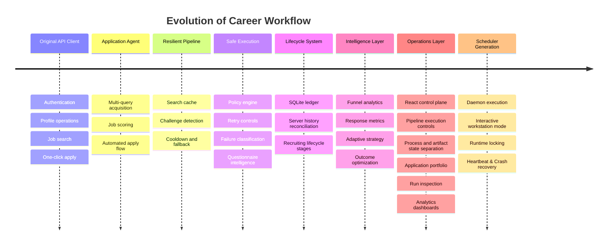

---

## 18. Testing

The repository contains a domain-organized test suite.

```text
tests/
├── acquisition/    provider health, JobSpy integration, merge & normalization
├── application/    policy, strategy, lifecycle, ledger, analytics, execution
├── client/         login, session, history, posting age policy, direct flows
├── llm/            local client, schemas, InferenceRouter, LLM resolver
├── orchestration/  Decision Ledger, Pipeline Intelligence, Pipeline Explorer
├── resolution/     constraints, hybrid resolution, telemetry, serialization
└── search/         acquisition, cache, challenge handling, cooldown
```

Complete validation:
```bash
rm -f data/ui_runtime/pipeline.lock && pytest
```

Current validation status:
- **500+ backend tests passing** (509 active unit & integration tests)
- Scheduler runtime tests passing
- Interactive scheduler tests passing
- Decision Ledger & Pipeline Explorer tests passing
- Provider & JobSpy integration tests passing

---

## 19. Roadmap

### Completed
- [x] API authentication, session management, job search and application execution
- [x] resilient multi-query acquisition with caching, challenge detection and cooldown handling
- [x] candidate-aware classification, scoring, location policy, selection and diversity controls
- [x] hybrid deterministic and local-LLM questionnaire resolution
- [x] persistent Decision Ledger (SQLite WAL), lifecycle tracking and server-history reconciliation
- [x] Pipeline Intelligence funnel analytics, response metrics and evidence-gated strategy
- [x] Career Workflow Operations Console (16 surfaces) for pipeline execution, Decision Ledger inspection, and workflow triage
- [x] Pipeline Explorer for stage execution timelines, decision trees, and artifact inspection
- [x] Automated System Audit framework generating component, AI integration, and policy diagnostic reports
- [x] Multi-provider architecture (Naukri, JobSpy) with runtime health tracking and degradation safeguards
- [x] InferenceRouter for LLM cost controls, Post-Score Guard output normalization, and Job Posting Age Policy filtering
- [x] daemon scheduler with runtime locking and recovery

### Next Operational Phase
- [ ] multi-platform job-source and application adapters beyond Naukri
- [ ] stronger browser automation for application flows that cannot be completed through direct APIs
- [ ] production deployment and remote operations for continuously running the workflow
- [ ] outcome-driven strategy optimization using application, recruiter-response and interview-conversion data

### Current Boundaries
- No hosted multi-user service; local operations control plane only
- No distributed worker architecture
- No guarantee of compatibility with future upstream API changes
- No claim that LLM-generated questionnaire answers are authoritative without candidate evidence

---

## 20. Contributing

Career Workflow preserves the engineering history of its evolution from the original NopeRi API client.

Contributions are welcome for new providers, orchestration improvements, runtime capabilities, analytics, AI integrations, testing, and developer tooling.

Please open an issue before introducing significant architectural changes.

### Attribution

The project originated from the open-source NopeRi project by Traverser25.

Repository history has been intentionally preserved to document the complete engineering evolution from the original API client to the current AI job operations platform while maintaining proper upstream attribution.

---

## 21. License

This project is intended for personal automation of the repository owner's own job-search workflow. It is not affiliated with Naukri or Info Edge. Users are responsible for reviewing applicable service terms and operating automation conservatively. Never commit credentials, session tokens, cookies, candidate evidence, raw application responses, or private application history to public source control.

**License:** Licensing of original contributions and upstream-derived portions should be considered separately unless explicit upstream permission is obtained.

---

<p align="center">
  <strong>Discover broadly. Decide carefully. Execute safely. Adapt from evidence.</strong>
</p>
