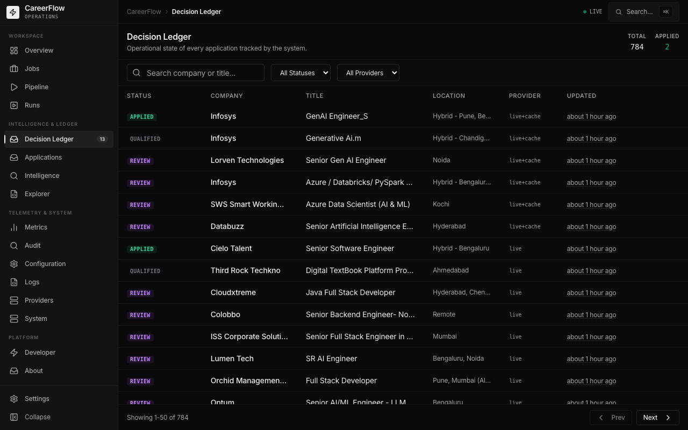
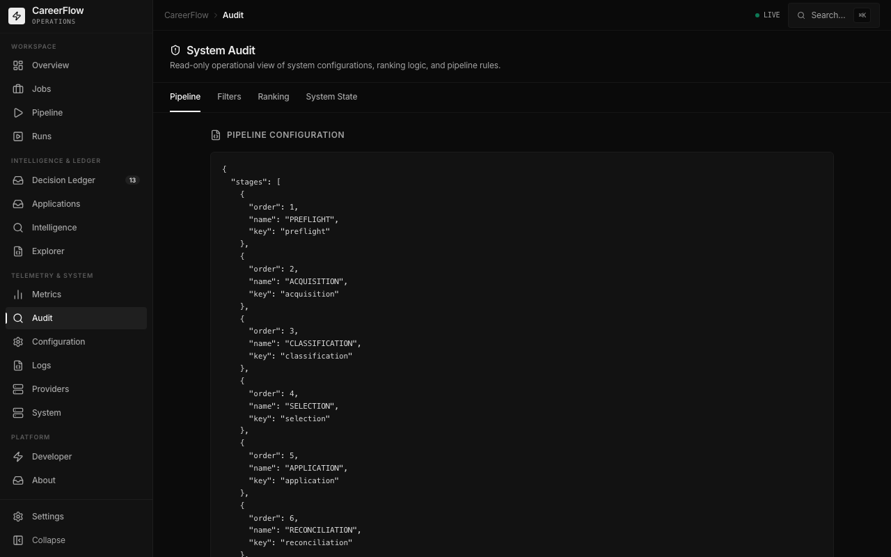

<p align="center">
  
</p>

<h1 align="center">Career Workflow</h1>

<p align="center">
  <strong>The definitive open-source AI Job Operations Platform.</strong>
</p>

<p align="center">
  
  
  
  
  
  
</p>

---

## ⚡ What is Career Workflow?

**Career Workflow** is a policy-driven, closed-loop job application orchestration engine designed for high-precision career operations. 

While typical "auto-apply" bots blind-fire resumes based on keyword matching, **Career Workflow** functions as an intelligent pipeline. It natively integrates with local (OMLX) and cloud (DeepSeek) LLM providers to deeply analyze Job Descriptions, enforce posting age policies, filter by complex transition-role logic, and automatically navigate multi-page dynamic questionnaires safely.

Every decision—from discovery to rejection to application submission—is recorded in a persistent, transactional **Decision Ledger** and is controllable via a unified **Operations Console** and **Rich CLI**. 

It’s built for Software Engineers, AI Engineers, and data professionals who treat their career transition like a production system.

---

## 🚀 Key Features

*   **Multi-Provider Acquisition**: Resilient search across JobSpy (Indeed, LinkedIn, Google) and Naukri API, backed by deduplication and job search caching.
*   **Inference Platform**: An intelligent `ProviderManager` enabling seamless failover across DeepSeek, OpenRouter, and a local OMLX fallback, coupled with token cost analytics.
*   **Pipeline Intelligence**: Granular telemetry tracking conversion rates, response velocity, subtrack breakdowns, and LLM avoidance rates.
*   **Decision Ledger**: SQLite WAL-backed single source of truth for qualification, application state, lifecycle tracking, and historical audit.
*   **Operations Console**: A 16-surface React unified dashboard allowing deep inspection of real-time execution, job inventory, and pipeline health.
*   **Rich CLI**: An intuitive Typer-based command-line interface providing live telemetry, artifact capturing, and system health checks out of the box.
*   **Policy Gating**: Built-in protections including Posting Age Limits, Post-Score normalizations, and company/role-family concentration guards.

---

## 📸 Platform Gallery

<details open>
  <summary><strong>Explore the Operations Console (Click to collapse)</strong></summary>
  <br/>
  
  <table>
    <tr>
      <td width="50%">
        <strong>Overview Dashboard</strong><br/>
        
        <br/><em>Live execution context, runtime state, and high-level conversion telemetry.</em>
      </td>
      <td width="50%">
        <strong>Pipeline Control</strong><br/>
        
        <br/><em>Configure run boundaries, launch live executions, and monitor progression.</em>
      </td>
    </tr>
    <tr>
      <td width="50%">
        <strong>Jobs Workspace</strong><br/>
        
        <br/><em>Categorized inventory of evaluated roles based on AI qualification scores.</em>
      </td>
      <td width="50%">
        <strong>Decision Ledger</strong><br/>
        
        <br/><em>Immutable history of system decisions, rejection reasons, and run artifacts.</em>
      </td>
    </tr>
    <tr>
      <td width="50%">
        <strong>Pipeline Intelligence</strong><br/>
        
        <br/><em>Real-time analytics on conversion funnels, subtracks, and response velocities.</em>
      </td>
      <td width="50%">
        <strong>System Audit</strong><br/>
        
        <br/><em>Automated health audits of runtime policies and AI integration endpoints.</em>
      </td>
    </tr>
    <tr>
      <td width="50%">
        <strong>Run Explorer</strong><br/>
        
        <br/><em>Deep dive into execution timelines, metrics, and manifest files per run.</em>
      </td>
      <td width="50%">
        <strong>Providers Intelligence</strong><br/>
        
        <br/><em>Search yield optimization and provider health tracking.</em>
      </td>
    </tr>
  </table>
</details>

---

## 🏗 Architecture

Career Workflow utilizes a decoupled, event-driven architecture designed for observability and safety. 

```mermaid
flowchart TD
    %% Core Orchestration Layer
    Pipeline["Pipeline Orchestrator"]
    EventBus{"EventBus\n(Telemetry & Metrics)"}
    StateManager["Runtime State Manager\n(Execution Locks)"]
    ViewModel["Unified Runtime ViewModel\n(State Projection)"]

    %% Intelligence & Data
    ProviderMgr["ProviderManager\n(DeepSeek / OMLX)"]
    DecisionLedger[("Decision Ledger\n(SQLite WAL)")]
    SnapshotStore[("Runtime Snapshots\n(Artifacts)") ]

    %% Presentation Layer
    CLI["Rich CLI\n(Typer)"]
    API["FastAPI Control Plane"]
    ReactUI["React Dashboard\n(Operations Console)"]

    %% Execution Flow
    Pipeline -->|Emits Events| EventBus
    EventBus -->|Updates| StateManager
    StateManager -->|Synchronizes| ViewModel
    Pipeline -->|Evaluates with| ProviderMgr
    Pipeline -->|Commits to| DecisionLedger
    EventBus -->|Persists| SnapshotStore

    %% Presentation Consumption
    ViewModel -.->|Live Projection| CLI
    ViewModel -.->|Live Projection| API
    DecisionLedger -.->|Historical Audit| API
    API <--> ReactUI
```

**Key Architectural Components:**
1. **EventBus**: Captures structural milestones (`JobAcquired`, `JobScored`, `ApplicationAttempted`).
2. **Runtime State Manager**: Enforces lock management and crash recovery semantics across pipeline executions.
3. **Unified Runtime ViewModel**: Aggregates state into a clean presentation layer, avoiding raw database queries during active runs.
4. **ProviderManager**: Manages inference budgets, failovers, and cost metrics across diverse LLMs.

---

## 💻 The Rich CLI

Career Workflow includes a comprehensive unified Typer CLI (`cw`) providing instant feedback, health diagnostics, and run inspection. 

### Usage & Commands

```bash
# Verify system dependencies, locks, database health, and provider configuration
cw doctor

# Execute a test run without making live network changes
cw run --test

# Launch the live application execution pipeline
cw run --live --confirm-live APPLY_LIVE

# Inspect the artifact manifest and timeline of the latest execution
cw inspect latest

# Start the daemon scheduler
cw schedule --interactive
```

### Run Output Example

```text
Starting Pipeline Run (live=False)

==================================================
  RELEASE 3.1.7 OVERLAY TELEMETRY (Applied AI Engineer)
==================================================
Target Role Overlay:         Applied AI Engineer
Candidate Intelligence Hash: dfbb80286ec1d265
Verified Certifications:     ['Microsoft Certified: Azure AI Engineer Associate']
Jobs acquired:               24
After normalization:         18
Submitted to LLM:            5
Rejected deterministically:  13
==================================================

RANKED CANDIDATES: 5
APPLY CONFIDENCE ELIGIBLE: 3
APPLY CONFIDENCE REJECTED: 2
FINAL APPLICATION QUEUE: 3

[DIAGNOSTICS] Artifact accounting validated successfully.
Run Complete.
```

---

## 🎛 Operations Console

The React-based **Operations Console** is treated as a first-class feature, serving as your daily command center.

*   **Architecture**: Built with React 19, Vite, TailwindCSS, and Zustand.
*   **Synchronization**: Utilizes custom React Query hooks (`useLedger`, `useAudit`) to asynchronously poll the FastAPI backend without overwhelming the SQLite WAL ledger.
*   **Runtime Intelligence**: Provides a live representation of the Unified Runtime ViewModel, updating pipeline progression metrics in real time.
*   **Decision Inspection**: Easily drill down into why the system rejected a job, analyzing the specific LLM feedback vs. posting age violations.

---

## 🧠 Inference Platform

The Inference Platform guarantees consistent AI evaluations while optimizing for cost.

*   **ProviderManager**: The central gateway standardizing API shapes across OpenAI, DeepSeek, and local providers.
*   **DeepSeek Integration**: Native support for DeepSeek's high-efficiency models.
*   **OMLX Fallback**: In the event of a cloud outage or rate limits, the platform gracefully fails over to a local instance of OMLX (e.g., Qwen models).
*   **Cost Analytics**: The `CostEngine` records every token to calculate exact theoretical savings (the cost avoided by deterministically dropping bad roles before hitting an LLM) and inference velocity.

---

## 🛠 Quick Start

### 1. Installation

```bash
# Clone the repository
git clone https://github.com/your-username/career-workflow-next.git
cd career-workflow-next

# Create a virtual environment
python -m venv .venv
source .venv/bin/activate

# Install dependencies (incorporates CLI entry points)
pip install -e .
```

### 2. Configuration

Copy the example configuration:
```bash
cp .env.example .env
```
Ensure you have the proper API keys configured for your AI Provider (e.g., `DEEPSEEK_API_KEY`) and job boards.

### 3. Verification

Run the built-in diagnostic tool to ensure everything is initialized properly:
```bash
cw doctor
```

### 4. Start the Application

**Start the FastAPI Control Plane:**
```bash
uvicorn api.main:app --reload
```

**Start the Operations Console:**
```bash
cd frontend
npm install
npm run dev
```

The Operations Console will be available at `http://localhost:5173`.

---

## 📝 License

Career Workflow is open-source software licensed under the MIT License.
