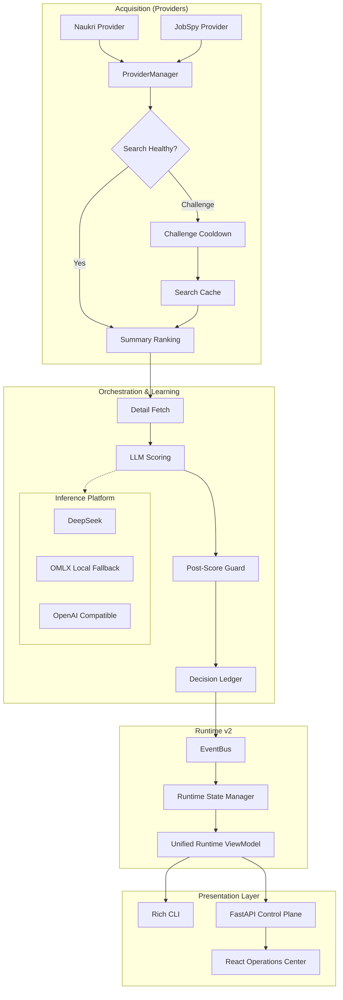

# Career Workflow Architecture

Career Workflow is an AI-assisted Job Operations Platform built on a strictly separated presentation, orchestration, and inference architecture. 

## System Overview

## Core Design Principles

1. **State is Authoritative**: The `Decision Ledger` is the absolute source of truth. The `Runtime State Manager` only reflects the *current execution session*.
2. **Event-Driven UI**: The Rich CLI and Operations Center do not directly query the executing pipeline. They read from the `Unified Runtime ViewModel` via the `EventBus`.
3. **Graceful Degradation**: Whether it's a provider challenge (JobSpy) or an LLM failure (DeepSeek), the system degrades gracefully to caches, local fallbacks (OMLX), or deterministic rules.

## Directory Structure
- `src/runtime/` - V2 Runtime architecture, State Manager, and ViewModel.
- `src/inference/` - Provider routing and LLM execution.
- `src/orchestration/` - EventBus, Decision Ledger, Pipeline Intelligence.
- `src/core/learning/` - Cost engines and telemetry.
- `src/presentation/` - Rich CLI and headless rendering.
- `api/` - FastAPI backend for the Operations Center.
- `frontend/` - React SPA Operations Center.
