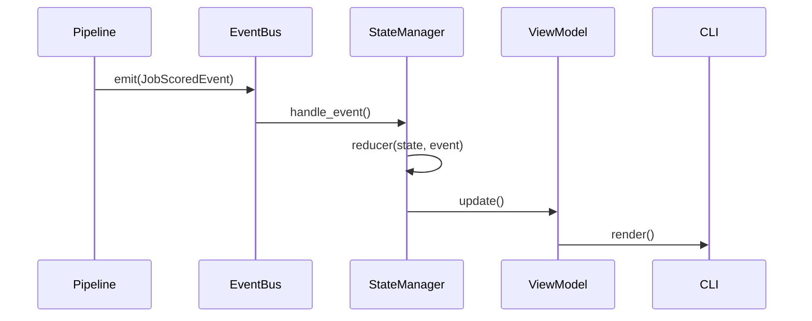

# Runtime v2

The Runtime v2 engine orchestrates the pipeline execution while strictly separating domain logic from presentation.

## Core Components

1. **EventBus (`src/orchestration/event_bus.py`)**
   - The central nervous system for pipeline events (`JobAcquired`, `JobScored`, `ApplicationAttempted`).
   
2. **Runtime State Manager (`src/runtime/state_manager.py`)**
   - Consumes events from the `EventBus`.
   - Uses functional reducers (`src/runtime/reducers.py`) to transition the internal process state.

3. **Unified Runtime ViewModel (`src/runtime/models.py`)**
   - A serializable, read-only projection of the current execution state.
   - Pushed continuously via the State Manager.

4. **Snapshotting (`src/runtime/snapshot.py`)**
   - Periodically flushes the ViewModel to disk (`runtime.json`) to allow headless recovery and external observability.

## Execution Flow

